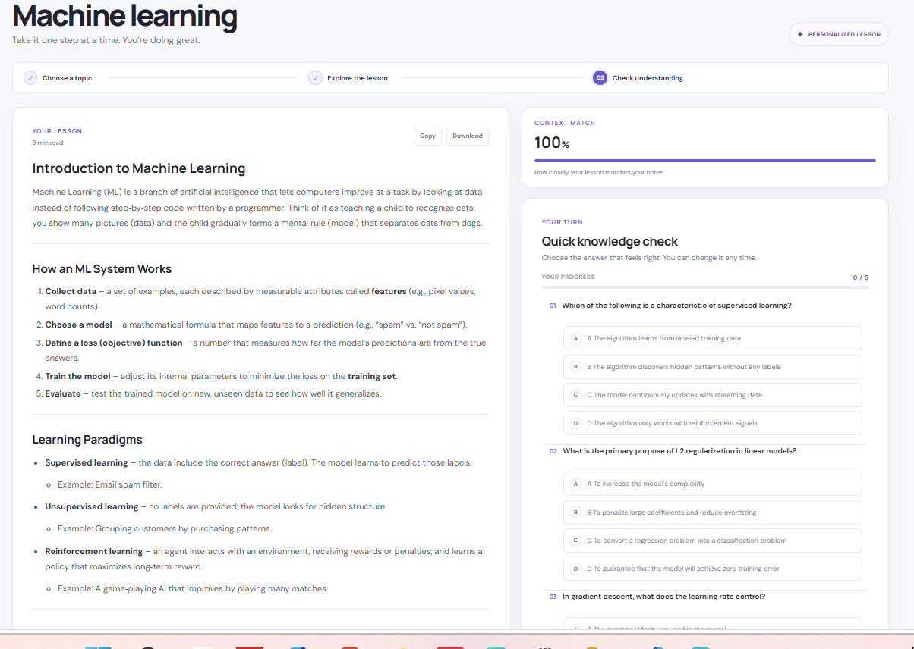
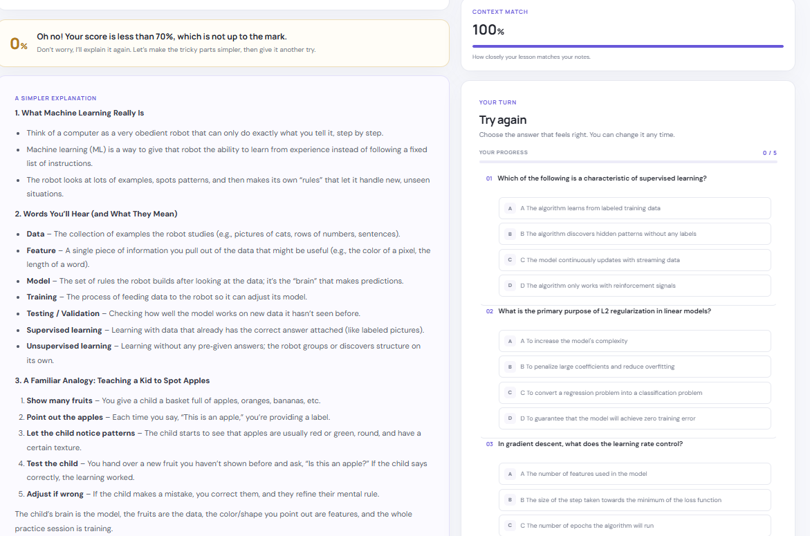
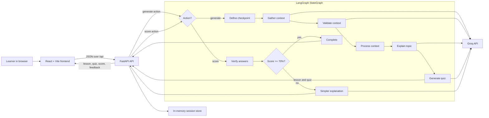

# Learning Agent

Learning Agent is an AI-assisted study app that turns a topic and optional notes into a beginner-friendly lesson and a multiple-choice quiz. Learners receive answer-by-answer feedback, a score, and—when their score is below 70%—a simpler explanation and another attempt.

The project has a React frontend and a Python FastAPI backend. The backend routes lesson generation and quiz scoring through a LangGraph `StateGraph`, with Groq used for context, lesson, quiz, and remediation generation. The Groq API key stays on the server.

## Interface

### Lesson and quiz



### Retry and simpler explanation



The responsive interface also includes a lesson view, quiz progress and review, context-match score, reading progress, and controls to copy or download lesson notes.

## Features

- Start a lesson on any topic; optional notes can guide the generated material.
- Generate background context when no notes are supplied.
- Show a context relevance score when context is available.
- Render lesson and remediation explanations as Markdown.
- Generate a five-question multiple-choice knowledge check.
- Score answers against the quiz already shown and review each response.
- Offer a simpler explanation and another quiz attempt when the score is below 70%.
- Track the current learning stage and page-reading progress.
- Copy lesson notes to the clipboard or download them as a Markdown file.

## Architecture



### Learning workflow

`src/graph.py` defines and compiles the active LangGraph `StateGraph`. LangGraph runs each node with a shared state and follows the graph's edges; this lets the app share lesson and quiz data across steps and route quiz results conditionally instead of hard-coding every step into a linear chain.

The graph state contains:

- `agent_state` — the existing `AgentState`, holding the topic/checkpoint, learner context, context relevance, lesson, quiz, submitted answers, feedback, score, retry flag, and messages.
- `action` — either `generate` or `score`, selecting which part of the graph should run for the current API request.

At invocation, a conditional edge from LangGraph's `START` selects the route based on `action`. The graph wraps the existing node functions with a small adapter: each function receives the nested `AgentState`, updates it, and returns it as a LangGraph state update.

### Lesson generation route

1. **Define checkpoint** — establishes the topic and checkpoint state.
2. **Gather context** — uses learner notes, or asks Groq for a short background summary if no notes were entered.
3. **Validate context** — compares the available context with the topic and stores a normalized relevance score.
4. **Process context** — passes raw context through; embeddings are not currently used.
5. **Explain topic** — asks Groq for a concise beginner-friendly Markdown lesson.
6. **Generate questions** — asks Groq for five multiple-choice questions, then ends the graph run.

### Answer scoring and remediation route

1. **Verify answers** — scores the answers against the quiz already stored in the session and creates per-question feedback.
2. **Decide progression** — checks the 70% threshold. A passing score routes to the graph end.
3. **Feynman explanation** — a score below 70% takes the conditional remediation edge, generates a simpler explanation, and then ends the graph run with the session ready for retry.

The API stores the workflow state under a generated session ID. It invokes the same graph with the scoring action both for initial answers and retries. The retry currently reuses the session's existing questions rather than generating another quiz.

The `/api/sessions` endpoint invokes the graph with `action="generate"` and stores the resulting `AgentState`. The answer and retry endpoints retrieve that state, set the submitted answers, and invoke the graph with `action="score"`. The graph ends after generating questions, after a passing score, or after producing remediation for a low score. The API then serializes the updated state for the React interface.

### Main components

- **Frontend:** React 18, Vite, `react-markdown`, and `remark-gfm`.
- **API:** FastAPI, Pydantic request validation, and Uvicorn.
- **Agent workflow:** LangGraph `StateGraph` with action-based entry routing and a conditional score/remediation edge. Graph nodes adapt the existing `AgentState`-mutating node functions into LangGraph state updates.
- **Model provider:** Groq Chat Completions. Current code uses `openai/gpt-oss-20b` for automatic context gathering and `openai/gpt-oss-120b` for relevance scoring, lessons, quizzes, and remediation.

## Repository layout

```text
.
├── api.py                         # FastAPI endpoints and in-memory sessions
├── requirements.txt               # Python dependencies
├── README.md
├── lesson.png                     # Lesson and quiz screenshot
├── tryagain.png                   # Retry and simpler explanation screenshot
├── src/
│   ├── main.py                    # Workflow entry point and answer-scoring flow
│   ├── state.py                   # AgentState shared by workflow nodes
│   ├── graph.py                   # Active LangGraph StateGraph and routing
│   └── nodes/
│       ├── define_checkpoint.py   # Initialize current topic/checkpoint
│       ├── gather_context.py      # Use notes or generate background context
│       ├── validate_context.py    # Relevance-scoring entry point
│       ├── relevance_scorer.py    # Score context match
│       ├── context_processor.py   # Context processing placeholder
│       ├── topic_explainer.py    # Generate the lesson
│       ├── question_generator.py # Generate quiz questions
│       ├── verifier.py           # Score answers and build feedback
│       ├── logic.py              # Apply the 70% progression threshold
│       └── feynman.py            # Generate a simpler explanation
└── frontend/
    ├── index.html                # Vite HTML entry point
    ├── src.jsx                   # React app and API interactions
    ├── style.css                 # Responsive light-theme layout
    ├── vite.config.js            # Development API proxy
    ├── package.json
    └── package-lock.json
```

## Requirements

- Python 3.10 or newer
- Node.js 18 or newer and npm
- A Groq API key with access to the model IDs configured in `src/nodes/`

## Run locally on Windows

Open two PowerShell terminals from the repository root.

### 1. Set up the backend

Create or activate a Conda environment:

```powershell
conda create -n learning-agent python=3.11
conda activate learning-agent
python -m pip install -r requirements.txt
```

If the environment already exists, just activate it and install/update the requirements.

Create a `.env` file in the repository root:

```dotenv
GROQ_API_KEY=your_groq_api_key
```

Do not commit `.env` or expose the key through a `VITE_*` frontend variable. The `.env` file is ignored by Git.

Start the API:

```powershell
python -m uvicorn api:app --reload
```

The API listens at `http://localhost:8000`. Check that it is running at `http://localhost:8000/api/health`.

### 2. Set up the frontend

In the second terminal:

```powershell
Set-Location .\frontend
npm ci
npm run dev
```

Open the local URL printed by Vite, normally `http://localhost:5173`. During development, Vite proxies `/api` requests to `http://localhost:8000`.

### Production frontend build

From the `frontend` directory:

```powershell
npm run build
npm run preview
```

Vite writes the static production site to `frontend/dist/`. `npm run preview` is for local previewing; deploy the generated static files to a static host.

## HTTP API

All endpoints are prefixed with `/api`. The FastAPI interactive API documentation is available at `http://localhost:8000/docs` while the backend is running.

| Method | Endpoint | Purpose |
| --- | --- | --- |
| `GET` | `/api/health` | Return `{"status":"ok"}` when the API is available. |
| `POST` | `/api/sessions` | Generate a lesson and quiz for a topic. |
| `POST` | `/api/sessions/{session_id}/answers` | Score answers for the current quiz. |
| `POST` | `/api/sessions/{session_id}/retry` | Score another attempt when a retry is pending. |

### Start a session

Request:

```json
{
  "topic": "Machine learning",
  "context": "Optional notes supplied by the learner"
}
```

`topic` must contain 1–300 characters; `context` is optional and limited to 20,000 characters.

The response includes `sessionId`, `phase`, `topic`, `relevanceScore`, `explanation`, `questions`, `score`, `answerFeedback`, and `feynmanExplanation`. A new session normally starts with `phase: "quiz"` and `score: null`. Each question contains its question text and options; the answer key is not returned to the browser before submission.

### Submit answers

Request:

```json
{
  "answers": ["A", "C", "B", "D", "A"]
}
```

Send one answer for each question. Answers may be option letters or the complete option text. The response includes the numeric score and per-question feedback after submission. Its phase is `retry` if the score is below 70%, otherwise `complete`.

Use the retry endpoint with the same request shape while the session phase is `retry`. It returns `retry` again if the score remains below 70%, or `complete` once the learner reaches the threshold.

### Error responses

- `422 Unprocessable Entity` — invalid request data or the wrong number of answers.
- `404 Not Found` — the session ID is unknown (for example, after an API restart).
- `409 Conflict` — retry requested when no retry is pending.

## Configuration

| Variable | Used by | Description |
| --- | --- | --- |
| `GROQ_API_KEY` | Backend | Required Groq API key. Keep it server-side. |
| `LEARNING_AGENT_CORS_ORIGINS` | Backend | Comma-separated allowed browser origins. Defaults to `http://localhost:5173`. |
| `VITE_API_BASE_URL` | Frontend build | Optional API base URL for a separately hosted backend. Empty by default, so requests are relative to the frontend origin. |
| `VITE_API_PROXY_TARGET` | Vite dev server | Optional backend URL for development proxying. Defaults to `http://localhost:8000`. |

For a local setup using a different frontend port, add that exact origin to `LEARNING_AGENT_CORS_ORIGINS`. For a deployed frontend and backend on separate domains, configure both the backend CORS allowlist and the frontend `VITE_API_BASE_URL`.

## Deployment notes

Deploy the frontend and backend as separate services:

1. Build `frontend` with `npm ci` and `npm run build`, then host the contents of `frontend/dist/` as a static site.
2. Run the repository root as a Python ASGI service, for example:

   ```text
   python -m uvicorn api:app --host 0.0.0.0 --port 8000
   ```

3. Set `GROQ_API_KEY` in the backend environment, and set `LEARNING_AGENT_CORS_ORIGINS` to the frontend's exact HTTPS origin.
4. Set `VITE_API_BASE_URL` to the backend's public URL at frontend build time, then rebuild the frontend.

The API currently keeps sessions in process memory and does not configure a LangGraph checkpointer. Sessions are lost when the backend restarts, and separate workers or instances do not share state. Add shared persistent storage and a compatible LangGraph checkpointer before running multiple workers or scaling horizontally.

## Troubleshooting

- **`ModuleNotFoundError` while starting the API:** Activate the intended Conda environment, then run `python -m pip install -r requirements.txt` in that same environment.
- **Missing Groq key:** Confirm `GROQ_API_KEY` is set in the root `.env` file or backend environment. Restart the API after changing environment variables.
- **Groq connection or SSL certificate errors:** Verify the computer's date and time and check the Python environment's CA certificate configuration. Do not disable TLS certificate verification.
- **Groq `model_not_found`:** Confirm the API key has access to the model IDs configured in `src/nodes/` and update those IDs if Groq changes model availability.
- **Browser cannot reach the API:** Confirm the backend health endpoint responds, the Vite proxy points to the right host, and the deployed frontend origin is allowed by `LEARNING_AGENT_CORS_ORIGINS`.
- **Session not found:** Sessions are process-local and disappear after an API restart; start a new lesson.

## Current limitations

- The API does not persist user accounts, sessions, or lesson history.
- Context processing currently passes raw text through; embeddings and retrieval are not implemented.
- The retry flow reuses the session's current quiz rather than generating a new set of questions.
- The LangGraph workflow currently runs in-process; it does not persist graph checkpoints or session state across backend restarts.
- The app depends on Groq availability, API credentials, and access to the configured models.
- Model-generated explanations and questions should be reviewed for accuracy before being used as authoritative study material.
